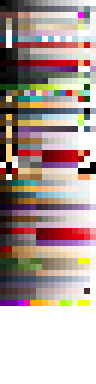
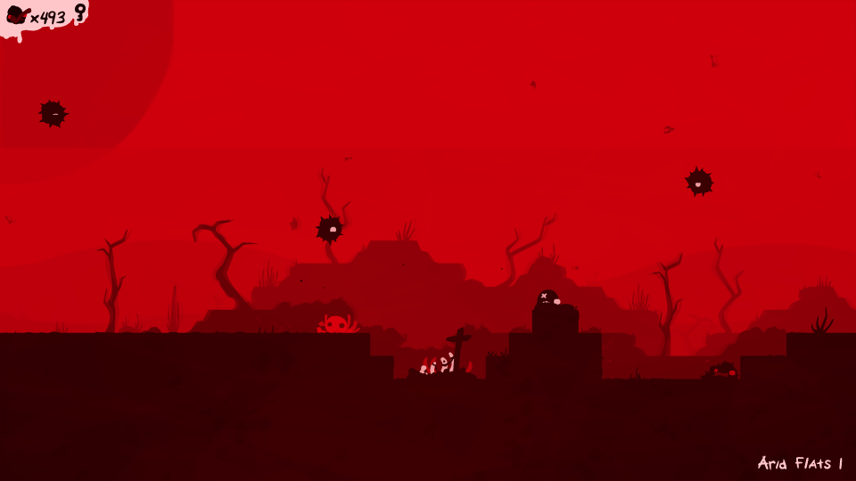

# Palettes
## Contents
+ [Overview](#Overview) - Details general palette information.
+ [Columns](#Columns) - Lists what all the palette columns are mapped to.
+ [Rows](#Rows) - Lists all the palettes in the game.
+ [Modifying Palettes](#Modifying-Palettes) - Explains how to modify existing palettes.
+ [Adding Palettes](#Adding-palettes) - Explains how to add new palettes.
+ [Remarks](#remarks) - General and misc. information.

## Overview
Location in the unpacked data: ```textures\palette.png```

Palettes are used to recolour the many different assests in The End is Nigh.
By loading different palettes for each unique area of the game, each zone is
able to look drastically different whilst using many of the same assets.

The file that defines the palette information can be opened in any basic paint
program to be modified, allowing for changes to be made to existing palettes as
well as the ability to create entirely new ones.

The palette is made up of pixels, and these pixels are interpreted in two ways:
as rows, and as a columns. The rows marks a unique palette that can be set, with
its row number acting as its palette ID (0 - 63). Whereas each column the pixel
is in (0 - 15) specifies what graphics the colour in that particular palette row
will be mapped to, whether its background tiles, water/lava, tile details, etc. 

## Columns

The following section describes what assets/graphics each column of the palette
is mapped to:

+ 00 - Active tiles (solids, spikes, etc) and the player.
+ 01 - Color of rings in carts
+ 02 - Decorations for active tiles (bricks, rocks, etc.).
+ 03 - Decorations for the first background layer.
+ 04 - First background layer.
+ 05 - Second background layer.
+ 06 - Skulls, seen on a veriety of enemies throughout the game.
+ 07 - Background image, layer 1.
+ 08 - Background image, layer 2.
+ 09 - Background image, layer 3.
+ 10 - Background image, layer 4.
+ 11 - Background image, layer 5.
+ 12 - Certain NPCs, and miscellaneous objects.
+ 13 - Toxic/Pollution, and miscellaneous objects.
+ 14 - Lava and water (a more desaturated version of the lava colour).
+ 15 - Character eyes and other facial features, text, and the glow effect in The Hollows.
	


These palette columns will also impact other small features of the game’s
graphics. However, these are the main uses of each of the different columns. 

## Rows

The following section describes each palette row, and where it is used in the game:

+ 00 - Super Mega Cart All Stars Intro Screen and The Game Intro Screen
+ 01 - The End and The Save Select Menu
+ 02 - Arid Flats
+ 03 - Overflow
+ 04 - The Split and Wall of Sorrow
+ 05 - Retrograde
+ 06 - The Hollows
+ 07 - Unused
+ 08 - SS Exodus
+ 09 - The Machine
+ 10 - Golgotha and Anguish
+ 11 - Gloom
+ 12 - Blight
+ 13 - Ruin
+ 14 - The End is Nigh Cartridge + Intro Screen and Corrupted Cartridge + Intro Screen
+ 15 - Unused
+ 16 - Mortaman Cartridge
+ 17 - Blaster Massacre Cartridge
+ 18 - Nevermore/The Future
+ 19 - River City Rancid Cartridge
+ 20 - Ash Climber Cartridge
+ 21 - Catastrovania Cartridge
+ 22 - Rubble Robble Cartridge
+ 23 - Fallen Fantasy Cartridge
+ 24 - Morbid Gear Cartridge
+ 25 - Dig Dead Cartridge
+ 26 - Super Mega Cart All Stars Cartridge
+ 27 - Spike Tales Cartridge
+ 28 - Scab or Die Cartridge
+ 29 - Tombs and Torture Cartridge
+ 30 - Mortaman Intro Screen and Pus-Man Cartridge + Intro Screen
+ 31 - Blaster Massacre Intro Screen
+ 32 - River City Rancid Intro Screen
+ 33 - Ash Climber Intro Screen
+ 34 - Catastrovania Intro Screen
+ 35 - Rubble Robble Intro Screen
+ 36 - Fallen Fantasy Intro Screen
+ 37 - Morbid Gear Intro Screen
+ 38 - Dig Dead Intro Screen
+ 39 - Unused
+ 40 - Spike Tales Intro Screen
+ 41 - Scab or Die Intro Screen
+ 42 - Tombs and Torture Intro Screen
+ 43 - Ghosts ’N Grieving Cartridge
+ 44 - Ghosts ’N Grieving Intro Screen
+ 45 - Depression Cartridge + Intro Screen
+ 46 - Denial Cartridge + Intro Screen
+ 47 - Anger Cartridge + Intro Screen
+ 48 - Bargaining Cartridge + Intro Screen
+ 49 - Acceptance Cartridge + Intro Screen
+ 50 - Dead Racer Cartridge + Intro Screen

All palettes onwards are unused and will display completely white unless
modified. This leaves modders with 16 palettes that can be added without needing
to modify the palette to accept more colours; see the second-half of the 
following section for details on how to add more palettes.

## Modifying Palettes
Once the palette.png file has been modified, or if you simply want to give an
area an existing palette, the tilesets.txt needs to be modified for a palette to
be assigned. Locate the unpacked game data and navigate to the "data\" directory,
in there will be a file called "tilesets.txt", open this file. Locate the area
which you would wish to modify, this can be found by looking at the area_name
variable which will list the name of each area. Once the area has been found
simply set the palette variable to the row number of your desired palette;
remember that the top-most row in the palette.png image is palette 0 and they
continue incrementing upwards in value the further down the image they are.

In the example below, the Arid Flats has been assigned the palette 10 (which is
used for Golgotha and Anguish). Changing this value and relaunching the game
produces the results on the right, compared to the original palette seen on the
left.

 

For a more in-depth look at the various aspects of the tilesets.txt file, as well
as how to modify it, click [here](./tileset.md).

## Adding Palettes
In its default state, the palettes file can only store 64 unique palette entries
(rows). However, this can be changed by modifying aspects of certain shader,
which can be located in the "shaders\" directory of the unpacked data. Two
specific shaders will need to be modified for this to work "colormapped.shader"
and "colormapped_duplicatedforstupidreasons.shader", as these shaders control
how colours from the palette are mapped to colours used by the game's assets.

Open both palettes in any text editor (Notepad, Notepad++, Sublime-Text, etc.)
and you will see the following text:

### colormapped:

```c
#version 130

uniform mat2x4 color_xform;
uniform sampler2D palettetex;
uniform float palette;

#if COMPILING_VERTEX_PROGRAM

    void vert(){
        //gl_FrontColor = gl_Color * color_xform[0] + color_xform[1];
        vec4 outcolor = gl_Color * color_xform[0] + color_xform[1];
        gl_FrontColor = vec4(texture(palettetex, vec2((outcolor.r*15.0+.5)/16.0,(palette+.5)/64.0)).rgb,
        outcolor.a);
        gl_Position = gl_ModelViewProjectionMatrix * gl_Vertex;
    }

#elif COMPILING_FRAGMENT_PROGRAM

    void frag(){
        gl_FragColor = gl_Color;
    }

#endif 
```

### colormapped_duplicatedforstupidreasons

```c
#version 130

uniform mat2x4 color_xform;
uniform sampler2D palettetex;
uniform float palette;

#if COMPILING_VERTEX_PROGRAM

    void vert(){
        //gl_FrontColor = gl_Color * color_xform[0] + color_xform[1];
        vec4 outcolor = gl_Color * color_xform[0] + color_xform[1];
    
        gl_FrontColor = vec4(texture(palettetex, vec2((outcolor.r*15.0+.5)/16.0,(palette+.5)/64.0)).rgb,
        outcolor.a);
        if(outcolor.r < .1 && outcolor.g < .1 && outcolor.b > .9){
            gl_FrontColor = vec4(0.0,0.0,0.0, outcolor.a);
        }
        gl_Position = gl_ModelViewProjectionMatrix * gl_Vertex;
    }

#elif COMPILING_FRAGMENT_PROGRAM

    void frag(){
        gl_FragColor = gl_Color;
    }

#endif
```

The highlighted values are the important ones, the 16.0 is the number of columns 
in the palette file (width) and the 64.0 is the number of rows in the palette
file (height). The height is the only value that needs to be modified, simply
change this value in both shaders to the number of however many palettes you
would like, make sure this matches your palette file itself. Now the new palette
row number (64 onwards) needs to simply be referenced in the "tilesets.txt" file
for the area that will use the new palette (see the [Modifying Palettes](#Modifying-Palettes) section
if you do not know how to set a palette for an area), and that is all that needs
to be done to add more palette rows to the game.

For more information regarding shaders, click here. 

## Remarks
Expanding the "palette.png" file to add more palettes, without making the
appropriate changes to the colour mapping shaders, will result in incorrect
colours and palettes being displayed.

Transparency/alpha is not read from the palette, so saving semi-transparent
pixels will simply result in the same colour being used in-game, but with the
alpha being set to full - removing the transparency. Fully transparent pixels
will either be black or white, depending on how the paint program being used to 
modify the palette handles saving transparency.

The map screen will make use of colours from the currently loaded area palette
to tint the different icons, graphics, etc. As will other graphical elements,
such as the tumor counter, NPC text boxes, etc. 
