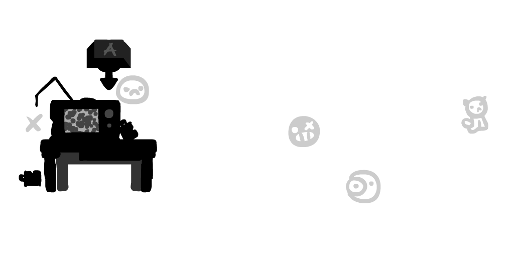
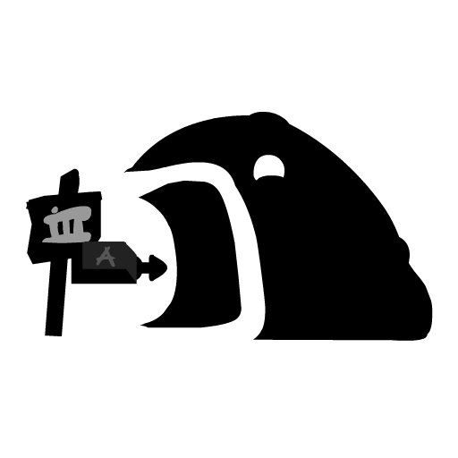
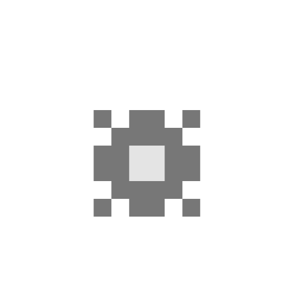
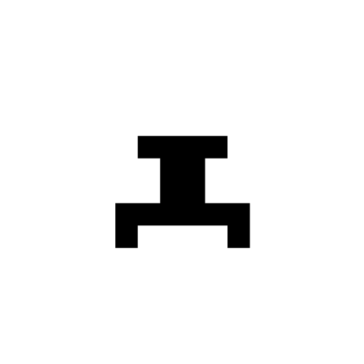
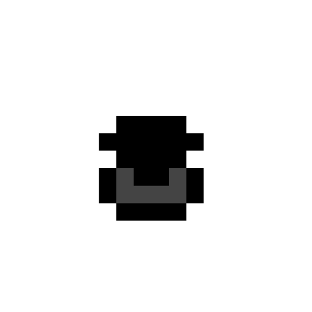
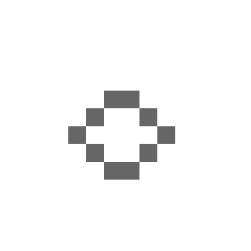
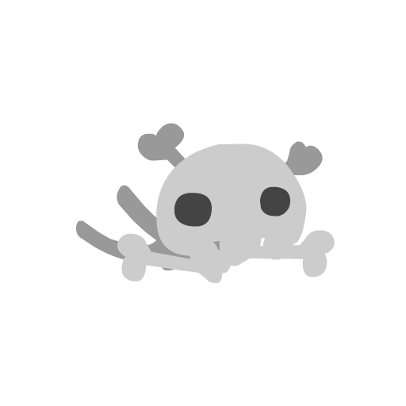
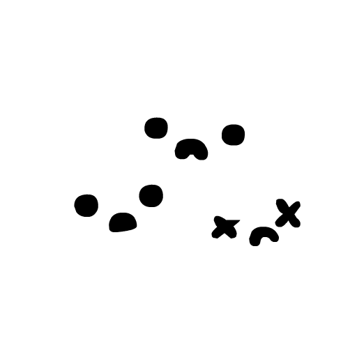

# Art Listing

The following listing displays all the known art alts. Many have pictures attached to provide a visual representation of what they look like, but for others just a description is supplied. The assets have been categorised, in the list below, to make finding the right art alt easier.

[General](listing.html#general) - Generic art assets and items.
[Enemies](listing.html#enemy) - The hostile enemies.
[Mini](listing.html#mini) - Small decorative creatures.
[Decorations](listing.html#decoration) - Decorative assets.
[Retro](listing.html#retro) - Retro entities and items.
[NPCs](listing.html#npc) - Interactive NPCs.
[Tilesets](listing.html#tileset) - The tile graphics.
[Overlays](listing.html#overlay) - Decorations on top of tile graphics.
[Backgrounds](listing.html#background) - Background images.
[Foregrounds](listing.html#foreground) - Foreground images.
[Mix-FX Layers](listing.html#midfx) - Shader effect layer graphics.
[Particles](listing.html#particles) - Effects and particles.
[Cutscenes](listing.html#cutscenes) - Video animations.
[Transitions](listing.html#transitions) - Screen transitions and effects.
[GUI](listing.html#gui) - Interface elements and UI graphics.
[Misc.](listing.html#misc) - Assets that fit in no category above, or are unused.

<h2 class="center">General</h2>
<table id="general" class="npcs">
    <tr>
        <td>

Player

</td>
        <td>

Life

</td>
        <td>

BigLife

</td>
        <td colspan="2">

CartConsole

</td>
    </tr>
</table>
<table class="npcs">
    <tr>
        <td>

Cartridge

</td>
        <td>

cart2

</td>
        <td>

cart3

</td>
        <td>

Key

</td>
        <td>

Hopper

</td>
    </tr>
</table>
<table class="npcs">
    <tr>
        <td>

ChainHitch

</td>
        <td>

ChainLink and ChainLink2

</td>
        <td>

FloatingMine

</td>
        <td>

Jar

</td>
        <td>

OutWarp

</td>
    </tr>
</table>
<table class="npcs">
    <tr>
        <td>

Gate1

</td>
        <td>

Gate2

</td>
        <td>

Gate3

</td>
        <td>

Gate4

</td>
        <td>

DeathGhost

</td>
    </tr>
</table>
<table class="npcs">
    <tr>
        <td>

TheHead

</td>
        <td>

TheBody

</td>
        <td>

TheHeart

</td>
        <td>

Stand

</td>
        <td>

FinalSteve

</td>
    </tr>
</table>
<table class="npcs">
    <tr>
        <td>

</td>
        <td>

GlowShroom

</td>
        <td>

GlowShroomSmall

</td>
        <td>

</td>
    </tr>
</table>
 

<h2 class="center">Enemies</h2>
<table id="enemy" class="npcs">
    <tr>
        <td>

MovingOrbBlob

</td>
        <td>

orbblob

</td>
        <td>

OrbBlob2

</td>
        <td>

OrbSmall

</td>
        <td>

OrbLarge

</td>
    </tr>
</table>
<table class="npcs">
    <tr>
        <td>

OrbLarge2

</td>
        <td>

OrbChomp

</td>
        <td>

AimSpitter

</td>
        <td>

AimSpitter2

</td>
        <td>

eyeshooter

</td>
    </tr>
</table>
<table class="npcs">
    <tr>
        <td>

SpitterX

</td>
        <td>

SpitterY

</td>
        <td>

Bullet

</td>
        <td>

eyebullet

</td>
        <td>

Floater

</td>
    </tr>
</table>
<table class="npcs">
    <tr>
        <td>

ChargeSlug

</td>
        <td>

Slug

</td>
        <td>

BigCharger

</td>
        <td>

BigSlug

</td>
        <td>

Splatter

</td>
    </tr>
</table>
<table class="npcs">
    <tr>
        <td>

Gasser

</td>
        <td>

GasCloud

</td>
        <td>

Cannon

</td>
        <td>

Cannonstand

</td>
        <td>

Cannonball

</td>
    </tr>
</table>
<table class="npcs">
    <tr>
        <td>

Fireball

</td>
        <td>

ThwampEye

</td>
        <td>

ThwampGear

</td>
        <td>

CheepCheep

</td>
        <td>

Frog

</td>
    </tr>
</table>
<table class="npcs">
    <tr>
        <td>

SkullCrow

</td>
        <td>

SkullFloater

</td>
        <td>

SkullFloaterBreaky

</td>
        <td>

SkullSlug

</td>
        <td>

Bouncer

</td>
    </tr>
</table>
<table class="npcs">
    <tr>
        <td>

ChainChomp

</td>
        <td>

CreepingMass

</td>
        <td>

CreepEye

</td>
        <td>

Fish

</td>
        <td>

Fish2

</td>
    </tr>
</table>
<table class="npcs">
    <tr>
        <td>

Mask

</td>
        <td>

Revolver

</td>
        <td>

gface and ElectroBall

</td>
        <td>

Ghost

</td>
        <td>

Sentry

</td>
    </tr>
</table>
 

<h2 class="center">Mini</h2>
<table id="mini" class="npcs">
    <tr>
        <td>

MiniDrone

</td>
        <td>

MiniBird

</td>
        <td>

Fly and MiniFly

</td>
        <td>

MiniFish

</td>
        <td>

MiniFishWhite

</td>
    </tr>
</table>
<table class="npcs">
    <tr>
        <td>

MiniFlea

</td>
        <td>

MiniFrog

</td>
        <td>

MiniFrogWhite

</td>
        <td>

MiniGhost

</td>
        <td>

MiniWisp

</td>
    </tr>
</table>
<table class="npcs">
    <tr>
        <td>

</td>
        <td>

MiniRat

</td>
        <td>

MiniRatWhite

</td>
        <td>

MiniWorm

</td>
        <td>

</td>
    </tr>
</table>
 

<h2 class="center">Decorations</h2>
<table id="decoration" class="npcs">
    <tr>
        <td>

Decoration0

</td>
        <td colspan="2">

Decoration1

</td>
        <td>

decoration 8 and Deco10

</td>
        <td>

Decoration9

</td>
    </tr>
</table>
<table class="npcs">
    <tr>
        <td colspan="2">

Decoration4

</td>
        <td>

Decoration5

</td>
        <td>

Decoration6

</td>
        <td>

Decoration7

</td>
    </tr>
</table>
<table class="npcs">
    <tr>
        <td>

Deco11

</td>
        <td>

inst10

</td>
        <td>

inst11

</td>
        <td>

eyeball

</td>
        <td>

EscapeEnd

</td>
    </tr>
</table>
 

<h2 class="center">Retro</h2>
<table id="retro" class="npcs">
    <tr>
        <td>

MiniDrone

</td>
        <td>

Cannonretro

</td>
        <td>

Cannonstandretro

</td>
        <td>

cannonballretro

</td>
        <td>

cannonballfireretro

</td>
    </tr>
</table>
<table class="npcs">
    <tr>
        <td>

Gasserretro

</td>
        <td>

GasCloudretro

</td>
        <td>

Floaterretro

</td>
        <td>

Floater2

</td>
        <td>

FloaterGlitch

</td>
    </tr>
</table>
<table class="npcs">
    <tr>
        <td>

SkullFloaterretro

</td>
        <td>

SkullSlugretro

</td>
        <td>

SkullCrowretro

</td>
        <td>

cheepretro

</td>
        <td>

Frogretro

</td>
    </tr>
</table>
<table class="npcs">
    <tr>
        <td>

RetroOrbSmall

</td>
        <td>

RetroOrbLarge

</td>
        <td>

pacman

</td>
        <td>

RetroElectroBall

</td>
        <td>

RetroGhost

</td>
    </tr>
</table>
<table class="npcs">
    <tr>
        <td>

Maskretro

</td>
        <td>

ChainChompretro

</td>
        <td>

ChainHitchretro

</td>
        <td>

ChainLinkretro

</td>
        <td>

Revolverretro

</td>
    </tr>
</table>
<table class="npcs">
    <tr>
        <td>

Bouncerretro

</td>
        <td>

CreepingMassRetro

</td>
        <td>

hopperretro

</td>
        <td>

ThwampEyeRetro

</td>
        <td>

ThwampGearRetro

</td>
    </tr>
</table>
<table class="npcs">
    <tr>
        <td>

Slugretro

</td>
        <td>

RetroChargerSlug

</td>
        <td>

Splatterretro

</td>
        <td>

bulletretro

</td>
        <td>

RetroFish

</td>
    </tr>
</table>
<table class="npcs">
    <tr>
        <td>

SpitterZretro

</td>
        <td>

SpitterYretro

</td>
        <td>

SpitterXretro

</td>
        <td>

Coin

</td>
        <td>

cartend

</td>
    </tr>
</table>
 

<h2 class="center">NPCs</h2>
<table id="npc" class="npcs">
    <tr>
        <td>

NPC0

</td>
        <td>

NPC1

</td>
        <td>

NPC2

</td>
        <td>

NPC3

</td>
        <td>

NPC4

</td>
        <td>

NPC5

</td>
    </tr>
</table>
<table class="npcs">
    <tr>
        <td>

NPC6

</td>
        <td>

NPC7

</td>
        <td>

NPC8

</td>
        <td>

NPC9

</td>
        <td>

NPC10

</td>
        <td>

NPC11

</td>
    </tr>
</table>
<table class="npcs">
    <tr>
        <td>

NPC12

</td>
        <td>

NPC13

</td>
        <td>

NPC14

</td>
        <td>

NPC15

</td>
        <td>

NPC16

</td>
        <td>

NPC17

</td>
    </tr>
</table>
<table class="npcs">
    <tr>
        <td>

NPCB1

</td>
        <td>

NPCB2

</td>
        <td>

NPCB3

</td>
        <td>

NPCB4

</td>
        <td>

NPCB5

</td>
        <td>

NPCB6

</td>
        <td>

NPCB7

</td>
    </tr>
</table>
<table class="npcs">
    <tr>
        <td>

NPCG1

</td>
        <td>

NPCG2

</td>
        <td>

NPCG3

</td>
        <td>

NPCG4

</td>
        <td>

NPCG5

</td>
        <td>

NPCG6

</td>
        <td>

NPCG7

</td>
    </tr>
</table>
<table class="npcs">
    <tr>
        <td>

NPCD1

</td>
        <td>

NPCD2

</td>
        <td>

NPCD3

</td>
        <td>

NPCD4

</td>
        <td>

NPCD5

</td>
        <td>

NPCD6

</td>
        <td>

NPCD7

</td>
    </tr>
</table>
<table class="npcs">
    <tr>
        <td>

NPCX1

</td>
        <td>

NPCX2

</td>
        <td>

NPCX3

</td>
        <td>

NPCX4

</td>
        <td>

NPCX5

</td>
    </tr>
</table>
<table class="npcs">
    <tr>
        <td>

NPCH1

</td>
        <td>

NPCH2

</td>
        <td>

NPCH3

</td>
        <td>

NPCH4

</td>
    </tr>
</table>
 

<h2 class="center">Tilesets</h2>
<table id="tileset" class="nobgtable">
    <tr>
        <td>

Tilecity

</td>
        <td>

Tilefield

</td>
    </tr>
</table>
<table class="nobgtable">
    <tr>
        <td>

Tilecaves

</td>
        <td>

Tiletox

</td></tr>
</table>
<table class="nobgtable">
    <tr>
        <td>

Tiletox2

</td>
        <td>

Tilehell

</td>
    </tr>
</table>
<table class="nobgtable">
    <tr>
        <td>

Tileairship

</td>
        <td>

Tilecomplex

</td>
    </tr>
</table>
<table class="nobgtable">
    <tr>
        <td>

theglow

</td>
        <td>

TileEnd

</td>
    </tr>
</table>
<table class="nobgtable">
    <tr>
        <td>

Tileretro

</td>
        <td>

TileGlitch

</td>
    </tr>
</table>
<table class="nobgtable">
    <tr>
        <td>

Tilesewers

</td>
        <td>

Tile

</td>
    </tr>
</table>
 

<h2 class="center">Overlays</h2>
<table id="overlay" class="nobgtable">
    <tr>
        <td>

Overlayscity

</td>
        <td>

Overlaysfield

</td>
    </tr>
</table>
<table class="nobgtable">
    <tr>
        <td>

Overlayscaves

</td>
        <td>

Overlaystox

</td></tr>
</table>
<table class="nobgtable">
    <tr>
        <td>

Overlaystox2

</td>
        <td>

Overlayshell

</td>
    </tr>
</table>
<table class="nobgtable">
    <tr>
        <td>

Overlaysairship

</td>
        <td>

Overlayscomplex

</td>
    </tr>
</table>
<table class="nobgtable">
    <tr>
        <td>

Overlaystheglow

</td>
        <td>

Overlaysend

</td>
    </tr>
</table>
<table class="nobgtable">
    <tr>
        <td>

Overlaysretro

</td>
        <td>

TileOverlays

</td>
    </tr>
</table>
 

<h2 class="center">Backgrounds</h2>
<table id="background" class="nobgtable">
    <tr>
        <td>

bg2

</td>
        <td>

ch2bg

</td>
    </tr>
</table>
<table class="nobgtable">
    <tr>
        <td>

ch3bg

</td>
        <td>

ch4abg

</td></tr>
</table>
<table class="nobgtable">
    <tr>
        <td>

Background

</td>
        <td>

hellbg

</td>
    </tr>
</table>
<table class="nobgtable">
    <tr>
        <td>

airshipbg

</td>
        <td>

field2bg

</td>
    </tr>
</table>
<table class="nobgtable">
    <tr>
        <td>

bgsolid

</td>
        <td>

neverbg

</td>
    </tr>
</table>
<table class="nobgtable">
    <tr>
        <td>

bgretro

</td>
        <td>

bgretrox

</td>
    </tr>
</table>
<table class="nobgtable">
    <tr>
        <td>

bgretro2

</td>
        <td>

None

</td>
    </tr>
</table>
 

<h2 class="center">Foregrounds</h2>
<table id="foreground" class="nobgtable">
    <tr>
        <td>

fg1

</td>
        <td>

fgretro

</td>
    </tr>
</table>
 

<h2 class="center">Mid-FX Layers</h2>
<table id="midfx" class="nobgtable">
    <tr>
        <td>

SolidBox

</td>
        <td>

ShadeBox

</td>
    </tr>
</table>
 
 

(The following art alts. are simply listed, and have no graphical representations yet.)

### Particles

ToxicParticle - Used in the toxic waterfall particle effect.
ToxicParticle2 - An unused variant of the toxic particle.
TestParticle - Used for the falling tile dust particle.
TestParticle2 - Used in a variety of different particle effects.
soliddrip - Used in a variety of liquid-based particle effects.
spark - A sparking particle.
spark2 - A slight variant on the other sparking particle.
Rock - Used in the rocks particle effect.
Rock2 - Used in a variety of block breaking particle effects.
Light - An orb of light used in a single particle effect.
Lightning - A lightning effect used in Nevermore and The Future.
Leaf - Falling leaves particle.
Leaf2 - A variant of the falling leaves particle.
goo1 - An unused goo particle.
goo2 - A goo particle used when splashing in toxic water.
Gibs - Unused player death particles.
Gibs2 - One of the particles used in the player’s death, chunks of gore.
DistortionParticle - Greeny-red blobs used in distortion-based particles.
DistortionParticle2 - A slight variation of the other distortion particle.
WindCloud - A variety of different cloud shapes.
cloud - Used in player/enemy bouncing particles and the exploding mines.
blackpart - One of the effects used in the player’s death, black circles.

### Cutscenes

towerending - Completing the Acceptance cartridge.
allstarending - Completing the All Stars cartridge.
towercart - Collecting all Iron Carts.
supercart - Collecting all regular Cartridges.
NevermoreCutscene - The intro after losing 450 tumors, the giant orb expanding.
NevermoreCutscene\_Win - The true ending for the game after beating Nevermore.
GameIntro - The intro cutscene before playing the cartridge.
CartIntro - The intro cutscene before playing the cartridge, with The End is Nigh cart intro as well.
IntroCutscene - Intro cutscene, after dying in the intro cartridge.
IntroCutscene\_Egg - The cutscene played if the intro cartridge is completed.
GameOverCutscene - Game over cutscene in The Future levels.
GameOverCutscene\_Cart - Game over screen in cartridge levels.
EscapeSequenceCutscene - The intro to the Acceptance escape sequence.
EscapeSequenceCutscene\_Win - Beating the Acceptance escape sequence, the end of the game.
CartIntro2 - Cartridge cover intro with fade into the level.
ContinueCutscene - Continue screen when enough lives are lost in a retro cartridge.
CartWin - Beating a cartridge screen.
AssembleDudeCutscene - The cutscene of the friend being assembled.

### Transitions

Wipetranswarp - Map warping and leaving a secret transition.
Wipetranssteven - Entering one of the The Future levels via a Steven.
Wipetransright - Screen wipe from left-to-right.
Wipetransleft - Screen wipe from right-to-left.
Wipetransdown - Screen wipe from bottom-to-top
Wipetransup - Screen wipe from top-to-bottom.
Wipetrans - The same as Wipetransright.
fadetrans - Fade to black.
retrofadetrans - Retro fade to black.
halfretrofadetrans - Retro fade to black and normal fade out from black.

### GUI

Unlockinfo - "Cartridge Unlocked" pop-up message.
Unlockinfo2 - "Warp Point Unlocked" pop-up message.
TumorIcon - The various tumor icons used on the top-left tumor count in-game.
TitleScreen - The game intro followed by the title screen.
SpeechBubble - An NPC speech bubble.
SpeechBubble2 - An NPC speech bubble.
SkipPrompt - The "Skip Cutscene" prompt.
SaveFileCard - One of the save file ghosts, showcasing unlock info.
RetroLivesCounter - A counter of the current number of lives.
prog\_cart - The progress counter on the left of regular carts: "1234!"
PauseMenu - The in-game pause menu screen.
MapPing - The downward arrow that points to important locations on the map.
MapIcon - The Ash icon that moves around the map.
map\_node - A singular dotted-line and area icon, with text.
Map - The entire map menu, with all the nodes, elements, and the background.
MainMenu\_Selector - The text featured on the title screen "Play", "Options", and "Quit".
LoadFile - The save file selection screen.
LevelTitle - The various area label frames fading in and out.
Letterbox - Screen letterboxing. (Used in cutscenes?)
HUD - The entirety of the on-screen HUD, including the escape counter.
DebugConsole - The debug console screen.

### Misc.

BigLink - Three chain links with a red scribble drawn through them.
x - An unused game over message, using the normal font.
Warp - A static piece of the secret "Leave Area" warp.
OS\_Indicator - A circle containing Ash’s face. (Potentially used to mark where/when Ash was off-screen?)
EscapeTrigger - A doodle of a character holding a bomb.
Carts - Placeholder cartridge art.
CamOverlay - Random text in the top-left corner of the screen.
PlayerTrail - The player’s trail. (In the air?)
PlayerTrailGround - The player’s trail on the ground.
PlayerTrailGround2 - A slightly different variant of the player’s trail on the ground.
PlayerTrailDucking - The player’s trail whilst ducking.
ButtonBlock\_Out - A tile shrinking, used when a switch despawns a tile.
ButtonBlock\_In - A tile expanding, used when a switch spawns a tile.
