# Art Listing

| Section                         | Description                                         |
| :------------------------------ | :-------------------------------------------------- |
| [General](#general)             | Generic assets and items.                           |
| [Enemies](#enemies)             | Hostile enemies.                                    |
| [Minis](#minis)                 | Small critters.                                     |
| [Decorations](#decorations)     | Decorative assets.                                  |
| [Retro](#retro)                 | Retro variants of entities and items.               |
| [NPCs](#npcs)                   | Interactive NPCs.                                   |
| [Tilesets](#tilesets)           | Tile graphics.                                      |
| [Overlays](#overlays)           | Decorations on top of tile graphics.                |
| [Backgrounds](#backgrounds)     | Background images.                                  |
| [Foregrounds](#foregrounds)     | Foreground images.                                  |
| [Mid-FX Layers](#midfx)         | Shader effect layer graphics.                       |
| [Particles](#particles)         | Effects and particles.                              |
| [Cutscenes](#cutscenes)         | In-game cutscenes and animations.                   |
| [Transitions](#transitions)     | Screen transitions and effects.                     |
| [GUI](#gui)                     | Interface elements and UI graphics.                 |
| [Miscellaneous](#miscellaneous) | Assets that fit in no category above or are unused. |

 

<!--
    The following tables have been implemented as HTML as it's easier to do.
    It might be nice to convert them into Markdown at some point though.
-->
<table id="general">
    <thead>
        <tr>
            <th align="center" colspan="5">General</th>
        </tr>
    </thead>
    <tbody>
        <tr>
            <td align="center"><code>Player</code></td>
            <td align="center"><code>Life</code></td>
            <td align="center">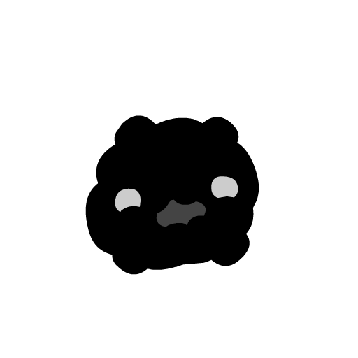<code>BigLife</code></td>
            <td align="center" colspan="2"><code>CartConsole</code></td>
        </tr>
        <tr>
            <td align="center"><code>Cartridge</code></td>
            <td align="center"><code>cart2</code></td>
            <td align="center"><code>cart3</code></td>
            <td align="center"><code>Key</code></td>
            <td align="center"><code>Hopper</code></td>
        </tr>
        <tr>
            <td align="center"><code>ChainHitch</code></td>
            <td align="center"><code>ChainLink</code> <code>ChainLink2</code></td>
            <td align="center"><code>FloatingMine</code></td>
            <td align="center"><code>Jar</code></td>
            <td align="center"><code>OutWarp</code></td>
        </tr>
        <tr>
            <td align="center"><code>Gate1</code></td>
            <td align="center"><code>Gate2</code></td>
            <td align="center"><code>Gate3</code></td>
            <td align="center"><code>Gate4</code></td>
            <td align="center"><code>DeathGhost</code></td>
        </tr>
        <tr>
            <td align="center"><code>TheHead</code></td>
            <td align="center"><code>TheBody</code></td>
            <td align="center"><code>TheHeart</code></td>
            <td align="center"><code>Stand</code></td>
            <td align="center">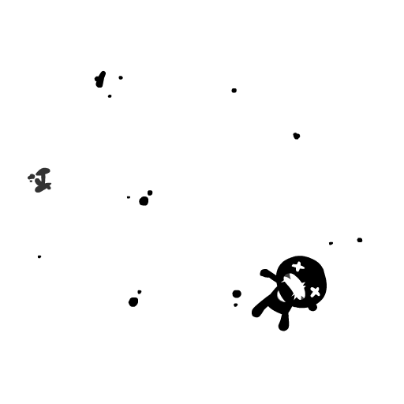<code>FinalSteve</code></td>
        </tr>
        <tr>
            <td align="center"><code>GlowShroom</code></td>
            <td align="center"><code>GlowShroomSmall</code></td>
            <td align="center"></td>
            <td align="center"></td>
            <td align="center"></td>
        </tr>
    </tbody>
</table>
 
<table id="enemies">
    <thead>
        <tr>
            <th align="center" colspan="5">Enemies</th>
        </tr>
    </thead>
    <tbody>
        <tr>
            <td align="center"><code>MovingOrbBlob</code></td>
            <td align="center"><code>OrbBlob</code></td>
            <td align="center">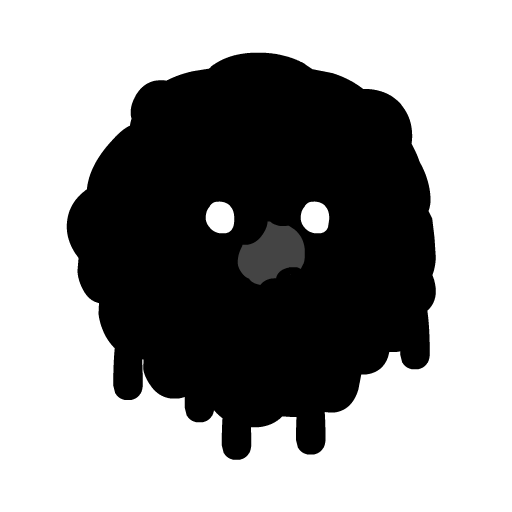<code>OrbBlob2</code></td>
            <td align="center"><code>OrbSmall</code></td>
            <td align="center">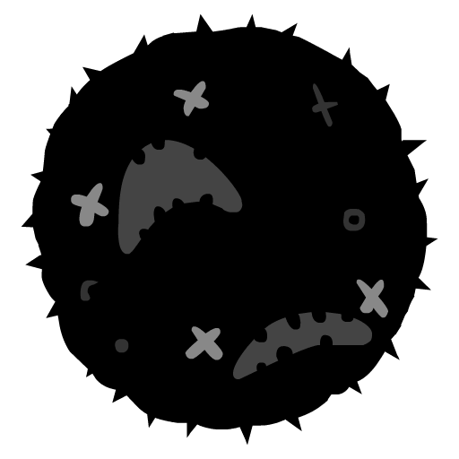<code>OrbLarge</code></td>
        </tr>
        <tr>
            <td align="center"><code>OrbLarge2</code></td>
            <td align="center"><code>OrbChomp</code></td>
            <td align="center"><code>AimSpitter</code></td>
            <td align="center"><code>AimSpitter2</code></td>
            <td align="center"><code>EyeShooter</code></td>
        </tr>
        <tr>
            <td align="center"><code>SpitterX</code></td>
            <td align="center"><code>SpitterY</code></td>
            <td align="center"><code>Bullet</code></td>
            <td align="center"><code>EyeBullet</code></td>
            <td align="center">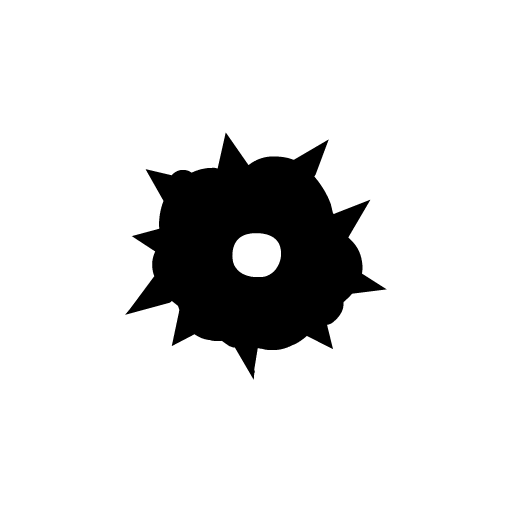<code>Floater</code></td>
        </tr>
        <tr>
            <td align="center"><code>ChargeSlug</code></td>
            <td align="center"><code>Slug</code></td>
            <td align="center"><code>BigCharger</code></td>
            <td align="center">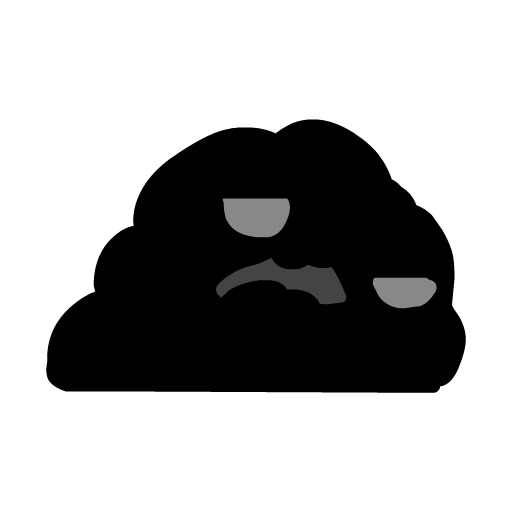<code>BigSlug</code></td>
            <td align="center"><code>Splatter</code></td>
        </tr>
        <tr>
            <td align="center"><code>Gasser</code></td>
            <td align="center"><code>GasCloud</code></td>
            <td align="center"><code>Cannon</code></td>
            <td align="center"><code>CannonStand</code></td>
            <td align="center">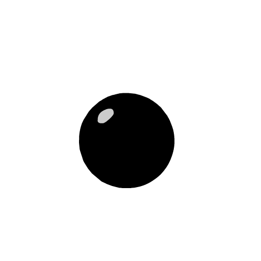<code>Cannonball</code></td>
        </tr>
        <tr>
            <td align="center">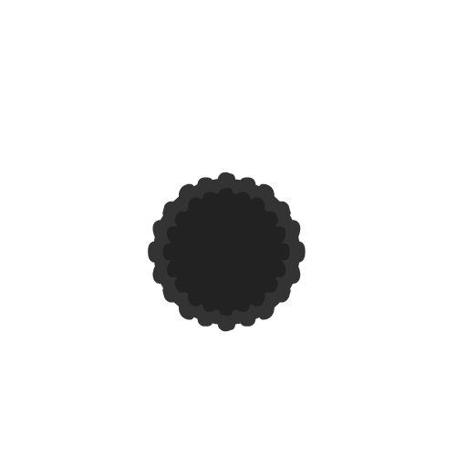<code>Fireball</code></td>
            <td align="center">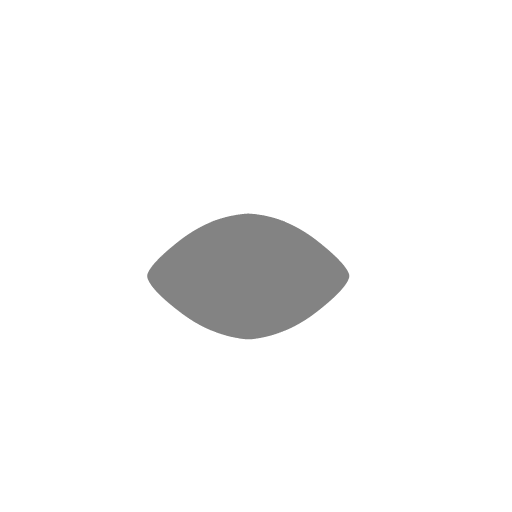<code>ThwampEye</code></td>
            <td align="center"><code>ThwampGear</code></td>
            <td align="center"><code>CheepCheep</code></td>
            <td align="center"><code>Frog</code></td>
        </tr>
        <tr>
            <td align="center"><code>SkullCrow</code></td>
            <td align="center"><code>SkullFloater</code></td>
            <td align="center"><code>SkullFloaterBreaky</code></td>
            <td align="center"><code>SkullSlug</code></td>
            <td align="center"><code>Bouncer</code></td>
        </tr>
        <tr>
            <td align="center"><code>ChainChomp</code></td>
            <td align="center"><code>CreepingMass</code></td>
            <td align="center"><code>CreepEye</code></td>
            <td align="center"><code>Fish</code></td>
            <td align="center"><code>Fish2</code></td>
        </tr>
        <tr>
            <td align="center"><code>Mask</code></td>
            <td align="center"><code>Revolver</code></td>
            <td align="center"><code>gface</code> <code>ElctroBall</code></td>
            <td align="center"><code>Ghost</code></td>
            <td align="center"><code>Sentry</code></td>
        </tr>
    </tbody>
</table>
 
<table id="minis">
    <thead>
        <tr>
            <th align="center" colspan="5">Minis</th>
        </tr>
    </thead>
    <tbody>
        <tr>
            <td align="center"><code>MiniDrone</code></td>
            <td align="center"><code>MiniBird</code></td>
            <td align="center"><code>Fly</code> <code>MiniFly</code></td>
            <td align="center"><code>MiniFish</code></td>
            <td align="center"><code>MiniFishWhite</code></td>
        </tr>
        <tr>
            <td align="center"><code>MiniFlea</code></td>
            <td align="center"><code>MiniFrog</code></td>
            <td align="center"><code>MiniFrogWhite</code></td>
            <td align="center"><code>MiniGhost</code></td>
            <td align="center"><code>MiniWisp</code></td>
        </tr>
        <tr>
            <td align="center"><code>MiniRat</code></td>
            <td align="center"><code>MiniRatWhite</code></td>
            <td align="center"><code>MiniWorm</code></td>
            <td align="center"></td>
            <td align="center"></td>
        </tr>
    </tbody>
</table>
 
<table id="decorations">
    <thead>
        <tr>
            <th align="center" colspan="5">Decorations</th>
        </tr>
    </thead>
    <tbody>
        <tr>
            <td align="center">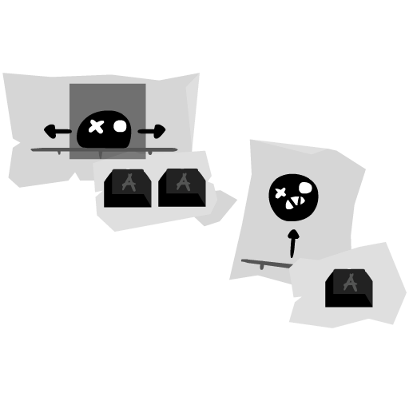<code>Decoration0</code></td>
            <td align="center" colspan="2"><code>Decoration1</code></td>
            <td align="center">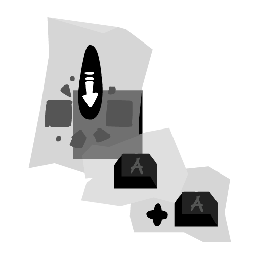<code>Deocration8</code> <code>Deco10</code></td>
            <td align="center"><code>Decoration9</code></td>
        </tr>
        <tr>
            <td align="center" colspan="2"><code>Decoration4</code></td>
            <td align="center"><code>Decoration5</code></td>
            <td align="center">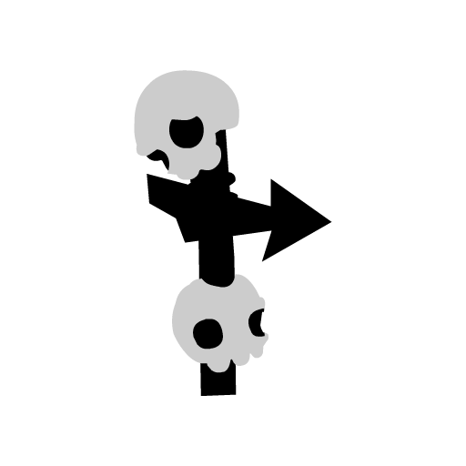<code>Deocration6</code></td>
            <td align="center"><code>Decoration7</code></td>
        </tr>
        <tr>
            <td align="center"><code>Deco11</code></td>
            <td align="center"><code>inst10</code></td>
            <td align="center">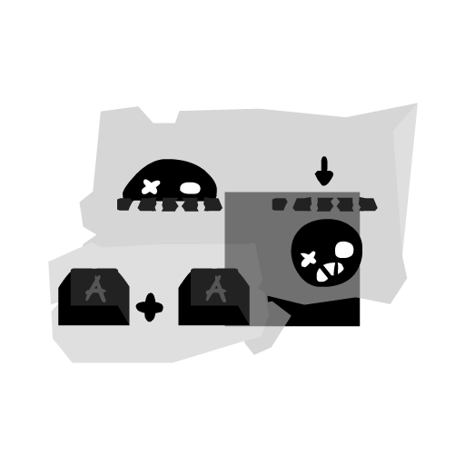<code>inst11</code></td>
            <td align="center"><code>eyeball</code></td>
            <td align="center"><code>EscapeEnd</code></td>
        </tr>
    </tbody>
</table>
 
<table id="retro">
    <thead>
        <tr>
            <th align="center" colspan="5">Retro</th>
        </tr>
    </thead>
    <tbody>
        <tr>
            <td align="center"><code>PlayerRetro</code></td>
            <td align="center"><code>Cannonretro</code></td>
            <td align="center"><code>Cannonstandretro</code></td>
            <td align="center"><code>cannonballretro</code></td>
            <td align="center"><code>cannonballfireretro</code></td>
        </tr>
        <tr>
            <td align="center"><code>Gasserretro</code></td>
            <td align="center">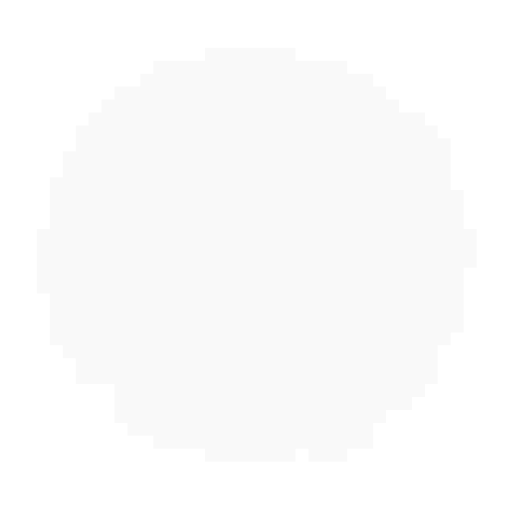<code>GasCloudretro</code></td>
            <td align="center"><code>Floaterretro</code></td>
            <td align="center"><code>Floater2</code></td>
            <td align="center"><code>FloaterGlitch</code></td>
        </tr>
        <tr>
            <td align="center"><code>SkullFloaterretro</code></td>
            <td align="center"><code>SkullSlugretro</code></td>
            <td align="center"><code>SkullCrowretro</code></td>
            <td align="center"><code>cheepretro</code></td>
            <td align="center"><code>Frogretro</code></td>
        </tr>
        <tr>
            <td align="center"><code>RetroOrbSmall</code></td>
            <td align="center"><code>retroOrbLarge</code></td>
            <td align="center"><code>pacman</code></td>
            <td align="center"><code>RetroElectroBall</code></td>
            <td align="center"><code>RetroGhost</code></td>
        </tr>
        <tr>
            <td align="center"><code>Maskretro</code></td>
            <td align="center"><code>ChainChompretro</code></td>
            <td align="center"><code>ChainHitchretro</code></td>
            <td align="center"><code>ChainLinkretro</code></td>
            <td align="center">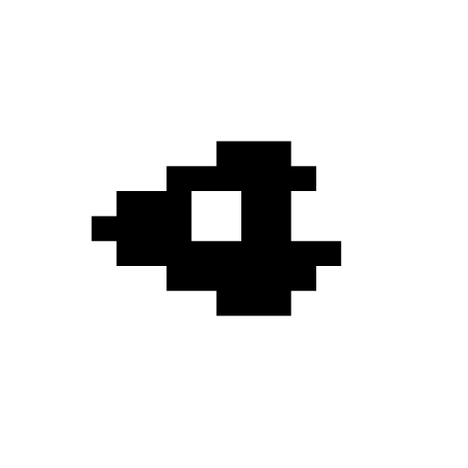<code>Revolverretro</code></td>
        </tr>
        <tr>
            <td align="center"><code>Bouncerretro</code></td>
            <td align="center"><code>CreepingMassRetro</code></td>
            <td align="center"><code>hopperretro</code></td>
            <td align="center"><code>ThwampEyeRetro</code></td>
            <td align="center"><code>ThwampGearRetro</code></td>
        </tr>
        <tr>
            <td align="center"><code>Slugretro</code></td>
            <td align="center"><code>RetroChargerSlug</code></td>
            <td align="center"><code>Splatterretro</code></td>
            <td align="center"><code>bulletretro</code></td>
            <td align="center"><code>RetroFish</code></td>
        </tr>
        <tr>
            <td align="center"><code>SpitterZretro</code></td>
            <td align="center"><code>SpitterYretro</code></td>
            <td align="center"><code>SpitterXretro</code></td>
            <td align="center"><code>Coin</code></td>
            <td align="center"><code>cartend</code></td>
        </tr>
    </tbody>
</table>
 
<table id="npcs">
    <thead>
        <tr>
            <th align="center" colspan="5">NPCs</th>
        </tr>
    </thead>
    <tbody>
        <tr>
            <td align="center"><code>NPC0</code></td>
            <td align="center"><code>NPC1</code></td>
            <td align="center"><code>NPC2</code></td>
            <td align="center"><code>NPC3</code></td>
            <td align="center"><code>NPC4</code></td>
        </tr>
        <tr>
            <td align="center"><code>NPC5</code></td>
            <td align="center"><code>NPC6</code></td>
            <td align="center">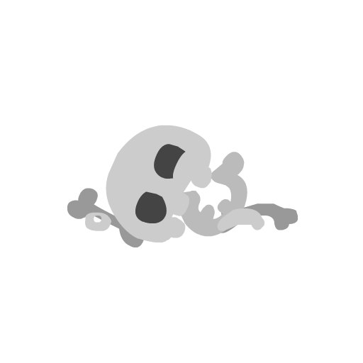<code>NPC7</code></td>
            <td align="center"><code>NPC8</code></td>
            <td align="center"><code>NPC9</code></td>
        </tr>
        <tr>
            <td align="center"><code>NPC10</code></td>
            <td align="center"><code>NPC11</code></td>
            <td align="center"><code>NPC12</code></td>
            <td align="center"><code>NPC13</code></td>
            <td align="center"><code>NPC14</code></td>
        </tr>
        <tr>
            <td align="center"><code>NPC15</code></td>
            <td align="center"><code>NPC16</code></td>
            <td align="center">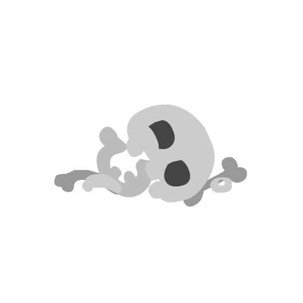<code>NPC17</code></td>
            <td align="center"><code>NPCB1</code></td>
            <td align="center"><code>NPCB2</code></td>
        </tr>
        <tr>
            <td align="center"><code>NPCB3</code></td>
            <td align="center"><code>NPCB4</code></td>
            <td align="center"><code>NPCB5</code></td>
            <td align="center"><code>NPCB6</code></td>
            <td align="center"><code>NPCB7</code></td>
        </tr>
        <tr>
            <td align="center"><code>NPCG1</code></td>
            <td align="center"><code>NPCG2</code></td>
            <td align="center"><code>NPCG3</code></td>
            <td align="center"><code>NPCG4</code></td>
            <td align="center"><code>NPCG5</code></td>
        </tr>
        <tr>
            <td align="center"><code>NPCG6</code></td>
            <td align="center"><code>NPCG7</code></td>
            <td align="center"><code>NPCD1</code></td>
            <td align="center"><code>NPCD2</code></td>
            <td align="center"><code>NPCD3</code></td>
        </tr>
        <tr>
            <td align="center"><code>NPCD4</code></td>
            <td align="center"><code>NPCD5</code></td>
            <td align="center"><code>NPCD6</code></td>
            <td align="center"><code>NPCD7</code></td>
            <td align="center">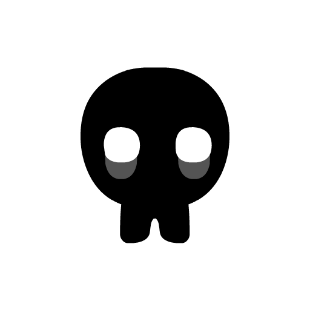<code>NPCX1</code></td>
        </tr>
        <tr>
            <td align="center"><code>NPCX2</code></td>
            <td align="center"><code>NPCX3</code></td>
            <td align="center"><code>NPCX4</code></td>
            <td align="center"><code>NPCX5</code></td>
            <td align="center"><code>NPCH1</code></td>
        </tr>
        <tr>
            <td align="center"><code>NPCH2</code></td>
            <td align="center"><code>NPCH3</code></td>
            <td align="center"><code>NPCH4</code></td>
            <td align="center"></td>
            <td align="center"></td>
        </tr>
    </tbody>
</table>
 
<table id="tilesets">
    <thead>
        <tr>
            <th align="center" colspan="2">Tilesets</th>
        </tr>
    </thead>
    <tbody>
        <tr>
            <td align="center"><code>Tilecity</code></td>
            <td align="center">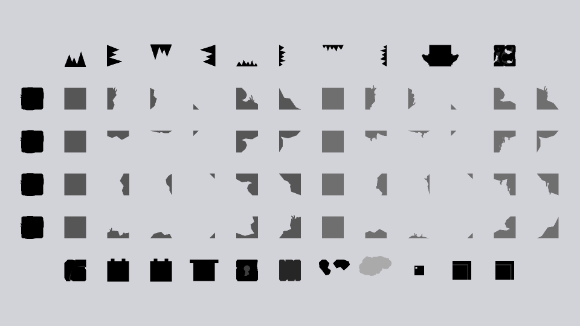<code>Tilefield</code></td>
        </tr>
        <tr>
            <td align="center"><code>Tilecaves</code></td>
            <td align="center"><code>Tiletox</code></td>
        </tr>
        <tr>
            <td align="center"><code>Tiletox2</code></td>
            <td align="center"><code>Tilehell</code></td>
        </tr>
        <tr>
            <td align="center"><code>Tileairship</code></td>
            <td align="center"><code>Tilecomplex</code></td>
        </tr>
        <tr>
            <td align="center"><code>theglow</code></td>
            <td align="center"><code>TileEnd</code></td>
        </tr>
        <tr>
            <td align="center"><code>Tileretro</code></td>
            <td align="center">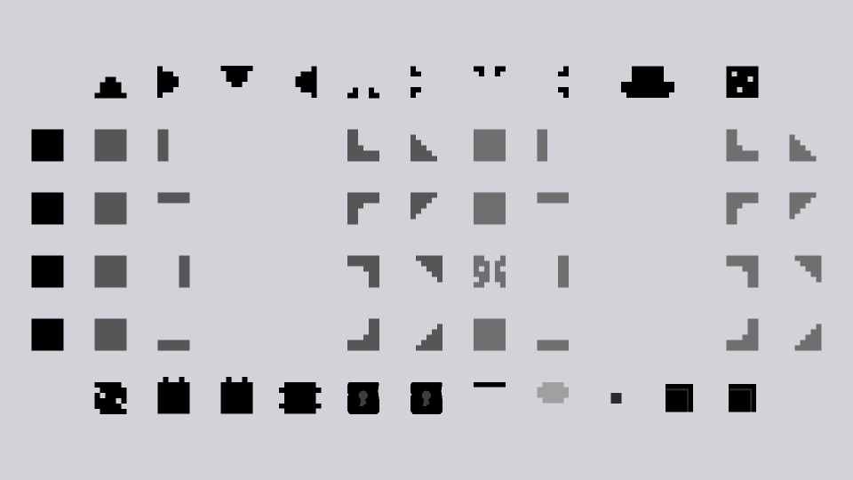<code>TileGlitch</code></td>
        </tr>
        <tr>
            <td align="center"><code>Tilesewers</code></td>
            <td align="center"><code>Tile</code></td>
        </tr>
    </tbody>
</table>
 
<table id="overlays">
    <thead>
        <tr>
            <th align="center" colspan="2">Overlays</th>
        </tr>
    </thead>
    <tbody>
        <tr>
            <td align="center"><code>Overlayscity</code></td>
            <td align="center"><code>Overlaysfield</code></td>
        </tr>
        <tr>
            <td align="center">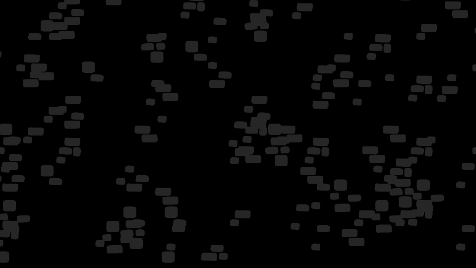<code>Overlayscaves</code></td>
            <td align="center"><code>Overlaystox</code></td>
        </tr>
        <tr>
            <td align="center"><code>Overlaystox2</code></td>
            <td align="center"><code>Overlayshell</code></td>
        </tr>
        <tr>
            <td align="center"><code>Overlaysairship</code></td>
            <td align="center"><code>Overlayscomplex</code></td>
        </tr>
        <tr>
            <td align="center"><code>Overlaystheglow</code></td>
            <td align="center"><code>Overlaysend</code></td>
        </tr>
        <tr>
            <td align="center"><code>Overlaysretro</code></td>
            <td align="center"><code>TileOverlays</code></td>
        </tr>
    </tbody>
</table>
 
<table id="backgrounds">
    <thead>
        <tr>
            <th align="center" colspan="2">Backgrounds</th>
        </tr>
    </thead>
    <tbody>
        <tr>
            <td align="center"><code>bg2</code></td>
            <td align="center"><code>ch2bg</code></td>
        </tr>
        <tr>
            <td align="center"><code>ch3bg</code></td>
            <td align="center"><code>ch4abg</code></td>
        </tr>
        <tr>
            <td align="center"><code>Background</code></td>
            <td align="center"><code>hellbg</code></td>
        </tr>
        <tr>
            <td align="center"><code>airshipbg</code></td>
            <td align="center"><code>field2bg</code></td>
        </tr>
        <tr>
            <td align="center"><code>bgsolid</code></td>
            <td align="center"><code>neverbg</code></td>
        </tr>
        <tr>
            <td align="center"><code>bgretro</code></td>
            <td align="center"><code>bgretrox</code></td>
        </tr>
        <tr>
            <td align="center"><code>bgretro2</code></td>
            <td align="center"><code>None</code></td>
        </tr>
    </tbody>
</table>
 
<table id="foregrounds">
    <thead>
        <tr>
            <th align="center" colspan="2">Foregrounds</th>
        </tr>
    </thead>
    <tbody>
        <tr>
            <td align="center"><code>fg1</code></td>
            <td align="center"><code>fgretro</code></td>
        </tr>
    </tbody>
</table>
 
<table id="midfx">
    <thead>
        <tr>
            <th align="center" colspan="2">Mid-FX Layers</th>
        </tr>
    </thead>
    <tbody>
        <tr>
            <td align="center"><code>SolidBox</code></td>
            <td align="center"><code>ShadeBox</code></td>
        </tr>
    </tbody>
</table>
 
<table id="particles">
    <thead>
        <tr>
            <th align="center" colspan="2">Particles</th>
        </tr>
    </thead>
    <tbody>
        <tr>
            <td><code>ToxicParticle</code></td>
            <td>Used in the toxic waterfall particle effect.</td>
        </tr>
        <tr>
            <td><code>ToxicParticle2</code></td>
            <td>An unused variant of the toxic particle.</td>
        </tr>
        <tr>
            <td><code>TestParticle</code></td>
            <td>Used for the falling tile dust particle.</td>
        </tr>
        <tr>
            <td><code>TestParticle2</code></td>
            <td>Used in a variety of different particle effects.</td>
        </tr>
        <tr>
            <td><code>soliddrip</code></td>
            <td>Used in a variety of liquid-based particle effects.</td>
        </tr>
        <tr>
            <td><code>spark</code></td>
            <td>A sparking particle.</td>
        </tr>
        <tr>
            <td><code>spark2</code></td>
            <td>A slight variation on the other sparking particle.</td>
        </tr>
        <tr>
            <td><code>Rock</code></td>
            <td>Used in the <code>rocks</code> particle effect.</td>
        </tr>
        <tr>
            <td><code>Rock2</code></td>
            <td>Used in a variety of block breaking particle effects.</td>
        </tr>
        <tr>
            <td><code>Light</code></td>
            <td>An orb of light used in a single particle effect.</td>
        </tr>
        <tr>
            <td><code>Lightning</code></td>
            <td>A lightning effect used in Nevermore and The Future.</td>
        </tr>
        <tr>
            <td><code>Leaf</code></td>
            <td>Falling leaves particle.</td>
        </tr>
        <tr>
            <td><code>Leaf2</code></td>
            <td>A slight variation of the falling leaves particle.</td>
        </tr>
        <tr>
            <td><code>goo1</code></td>
            <td>An unused goo particle.</td>
        </tr>
        <tr>
            <td><code>goo2</code></td>
            <td>A goo particle used when splashing in toxic water.</td>
        </tr>
        <tr>
            <td><code>Gibs</code></td>
            <td>Unused player death particles.</td>
        </tr>
        <tr>
            <td><code>Gibs2</code></td>
            <td>One of the particles used in the player's death.</td>
        </tr>
        <tr>
            <td><code>DistortionParticle</code></td>
            <td>Greeny-red blobs used in distortion-based particles.</td>
        </tr>
        <tr>
            <td><code>DistortionParticle2</code></td>
            <td>A slight variation of the other distortion-based particle.</td>
        </tr>
        <tr>
            <td><code>WindCloud</code></td>
            <td>A variety of different cloud shapes.</td>
        </tr>
        <tr>
            <td><code>Cloud</code></td>
            <td>Used in player/enemy bouncing particles and the exploding mines.</td>
        </tr>
        <tr>
            <td><code>blackpart</code></td>
            <td>One of the effects used in the player's death.</td>
        </tr>
    </tbody>
</table>
 
<table id="cutscenes">
    <thead>
        <tr>
            <th align="center" colspan="2">Cutscenes</th>
        </tr>
    </thead>
    <tbody>
        <tr>
            <td><code>towerending</code></td>
            <td>Completing the Acceptance cartridge.</td>
        </tr>
        <tr>
            <td><code>allstarending</code></td>
            <td>Completing the All Stars cartridge.</td>
        </tr>
        <tr>
            <td><code>towercart</code></td>
            <td>Collecting all Iron Carts.</td>
        </tr>
        <tr>
            <td><code>supercart</code></td>
            <td>Collecting all Regular Carts</td>
        </tr>
        <tr>
            <td><code>NevermoreCutscene</code></td>
            <td>Intro after losing 450 tumors.</td>
        </tr>
        <tr>
            <td><code>NevermoreCutscene_Win</code></td>
            <td>True ending for the game after beating Nevermore.</td>
        </tr>
        <tr>
            <td><code>GameIntro</code></td>
            <td>Intro cutscene before playing the cartridge.</td>
        </tr>
        <tr>
            <td><code>CartIntro</code></td>
            <td>Intro cutscene before playing the cartridge, with The End is Nigh cart intro as well.</td>
        </tr>
        <tr>
            <td><code>IntroCutscene</code></td>
            <td>Intro cutscene after dying in the intor cartridge.</td>
        </tr>
        <tr>
            <td><code>IntroCutscene_Egg</code></td>
            <td>Cutscene played if the intor cartridge is completed.</td>
        </tr>
        <tr>
            <td><code>GameOverCutscene</code></td>
            <td>Game over screen in The Future levels.</td>
        </tr>
        <tr>
            <td><code>GameOverCutscene_Cart</code></td>
            <td>Game over screen in the cartridge levels.</td>
        </tr>
        <tr>
            <td><code>EscapeSequenceCutscene</code></td>
            <td>Intro to the Acceptance escape sequence.</td>
        </tr>
        <tr>
            <td><code>EscapeSequenceCutscene_Win</code></td>
            <td>Ending cutscene for beating the Acceptance escape sequence.</td>
        </tr>
        <tr>
            <td><code>CartIntro2</code></td>
            <td>Cartridge cover intro with fade into the level.</td>
        </tr>
        <tr>
            <td><code>ContinueCutscene</code></td>
            <td>Continue screen when all lives are lost in a retro cartridge.</td>
        </tr>
        <tr>
            <td><code>CartWin</code></td>
            <td>Screen for beating a cartridge.</td>
        </tr>
        <tr>
            <td><code>AssembleDudeCutscene</code></td>
            <td>Cutscene played after all friend pieces have been assembled.</td>
        </tr>
    </tbody>
</table>
 
<table id="transitions">
    <thead>
        <tr>
            <th align="center" colspan="2">Transitions</th>
        </tr>
    </thead>
    <tbody>
        <tr>
            <td><code>Wipetranswarp</code></td>
            <td>Map warping and leaving a secret transition.</td>
        </tr>
        <tr>
            <td><code>Wipetranssteven</code></td>
            <td>Entering one of The Future levels via a Steven.</td>
        </tr>
        <tr>
            <td><code>Wipetransright</code></td>
            <td>Screen wipe from left-to-right.</td>
        </tr>
        <tr>
            <td><code>Wipetransleft</code></td>
            <td>Screen wipe from right-to-left.</td>
        </tr>
        <tr>
            <td><code>Wipetransdown</code></td>
            <td>Screen wipe from top-to-bottom.</td>
        </tr>
        <tr>
            <td><code>Wipetransup</code></td>
            <td>Screen wipe from bottom-to-top.</td>
        </tr>
        <tr>
            <td><code>Wipetrans</code></td>
            <td>Screen wipe from left-to-right.</td>
        </tr>
        <tr>
            <td><code>fadetrans</code></td>
            <td>Retro fade to black.</td>
        </tr>
        <tr>
            <td><code>halfretrofadetrans</code></td>
            <td>Retro fade to black and normal fade out from black.</td>
        </tr>
    </tbody>
</table>
 
<table id="gui">
    <thead>
        <tr>
            <th align="center" colspan="2">GUI</th>
        </tr>
    </thead>
    <tbody>
        <tr>
            <td><code>Unlockinfo</code></td>
            <td>"Cartridge Unlocked" pop-up message.</td>
        </tr>
        <tr>
            <td><code>Unlockinfo2</code></td>
            <td>"Warp Point Unlocked" pop-up message.</td>
        </tr>
        <tr>
            <td><code>TumorIcon</code></td>
            <td>Various tumor icons used for the top-left tumor count.</td>
        </tr>
        <tr>
            <td><code>TitleScreen</code></td>
            <td>Game intro followed by the title screen animation.</td>
        </tr>
        <tr>
            <td><code>SpeechBubble</code></td>
            <td>NPC speech bubble.</td>
        </tr>
        <tr>
            <td><code>SpeechBubble2</code></td>
            <td>NPC speech bubble.</td>
        </tr>
        <tr>
            <td><code>SkipPrompt</code></td>
            <td>"Skip Cutscene" prompt.</td>
        </tr>
        <tr>
            <td><code>SaveFileCard</code></td>
            <td>One of the save file ghosts with unlock info.</td>
        </tr>
        <tr>
            <td><code>RetroLivesCounter</code></td>
            <td>Counter of the current number of lives in a cartridge.</td>
        </tr>
        <tr>
            <td><code>prog_cart</code></td>
            <td>Progress counter for cartridges on the select screen.</td>
        </tr>
        <tr>
            <td><code>PauseMenu</code></td>
            <td>Pause menu screen.</td>
        </tr>
        <tr>
            <td><code>MapPing</code></td>
            <td>Downward arrow that points to important locations on the map.</td>
        </tr>
        <tr>
            <td><code>MapIcon</code></td>
            <td>Ash icon that moves around the map.</td>
        </tr>
        <tr>
            <td><code>map_node</code></td>
            <td>Singular dotted-line and area icon with text for the map.</td>
        </tr>
        <tr>
            <td><code>Map</code></td>
            <td>Entire map menu with all of the map nodes.</td>
        </tr>
        <tr>
            <td><code>MainMenu_Selector</code></td>
            <td>Text options on the main menu of the game.</td>
        </tr>
        <tr>
            <td><code>LoadFile</code></td>
            <td>Entire save file selection screen.</td>
        </tr>
        <tr>
            <td><code>LevelTitle</code></td>
            <td>Area label frames that fade in and out.</td>
        </tr>
        <tr>
            <td><code>LetterBox</code></td>
            <td>Letterboxing effect.</td>
        </tr>
        <tr>
            <td><code>HUD</code></td>
            <td>All of the on-screen HUD elements (including Acceptance escape counter).</td>
        </tr>
        <tr>
            <td><code>DebugConsole</code></td>
            <td>Debug console screen.</td>
        </tr>
    </tbody>
</table>
 
<table id="miscellaneous">
    <thead>
        <tr>
            <th align="center" colspan="2">Miscellaneous</th>
        </tr>
    </thead>
    <tbody>
        <tr>
            <td><code>BigLink</code></td>
            <td>Three chain links with a red scribble drawn through them.</td>
        </tr>
        <tr>
            <td><code>x</code></td>
            <td>Unused game over message using the normal font.</td>
        </tr>
        <tr>
            <td><code>Warp</code></td>
            <td>A static piece of the scret "Leave Area" warp graphic.</td>
        </tr>
        <tr>
            <td><code>OS_Indicator</code></td>
            <td>Circle containing Ash's face.</td>
        </tr>
        <tr>
            <td><code>EscapeTrigger</code></td>
            <td>Doodle of a character holding a bomb.</td>
        </tr>
        <tr>
            <td><code>Carts</code></td>
            <td>Placeholder cartridge art.</td>
        </tr>
        <tr>
            <td><code>CamOverlay</code></td>
            <td>Random text in the top-left corner of the screen.</td>
        </tr>
        <tr>
            <td><code>PlayerTrail</code></td>
            <td>Player's trail in the air.</td>
        </tr>
        <tr>
            <td><code>PlayerTrailGround</code></td>
            <td>Player's trail on the ground.</td>
        </tr>
        <tr>
            <td><code>PlayerTrailGround2</code></td>
            <td>Slightly different variation of the player's trail on the ground.</td>
        </tr>
        <tr>
            <td><code>PlayerTrailDucking</code></td>
            <td>Player's trail whilst ducking.</td>
        </tr>
        <tr>
            <td><code>ButtonBlock_Out</code></td>
            <td>Tile shrinking animation used when a switch despawns a tile.</td>
        </tr>
        <tr>
            <td><code>ButtonBlock_In</code></td>
            <td>Tile expanding animation used when a switch spawns a tile.</td>
        </tr>
    </tbody>
</table>
