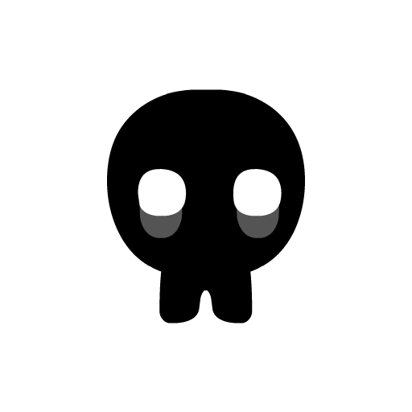

# NPC Listing (IDs and Movie Clips)

A graphical list displaying all of the NPCs within the game. With their 
appropriate NPC IDs (the values used to set NPCs in the Tilesets file) below 
them, these values also double-up as being the names used to reference the 
particular movie_clip (graphic/sprite) that an NPC is given. Remember that
variables and their values are case-sensitive, in the case of NPCs all of the
IDs are fully capitalised, no lower-case.

<script src="../../assets/scripts/npcs.js"></script>

## Skeletons
<!--<script type="text/javascript">display_npcs("npc", 17, start = 0, padding = 2, per_row = 6)</script>-->
<table id="npc" class="npcs">
    <tr>
        <td><div class="center"><p><span class="variable">NPC0</span></p></div></td>
        <td><div class="center"><p><span class="variable">NPC1</span></p></div></td>
        <td><div class="center"><p><span class="variable">NPC2</span></p></div></td>
        <td><div class="center"><p><span class="variable">NPC3</span></p></div></td>
        <td><div class="center"><p><span class="variable">NPC4</span></p></div></td>
        <td><div class="center"><p><span class="variable">NPC5</span></p></div></td>
    </tr>
</table>
<table class="npcs">
    <tr>
        <td><div class="center"><p><span class="variable">NPC6</span></p></div></td>
        <td><div class="center"><p><span class="variable">NPC7</span></p></div></td>
        <td><div class="center"><p><span class="variable">NPC8</span></p></div></td>
        <td><div class="center"><p><span class="variable">NPC9</span></p></div></td>
        <td><div class="center"><p><span class="variable">NPC10</span></p></div></td>
        <td><div class="center"><p><span class="variable">NPC11</span></p></div></td>
    </tr>
</table>
<table class="npcs">
    <tr>
        <td><div class="center"><p><span class="variable">NPC12</span></p></div></td>
        <td><div class="center"><p><span class="variable">NPC13</span></p></div></td>
        <td><div class="center"><p><span class="variable">NPC14</span></p></div></td>
        <td><div class="center"><p><span class="variable">NPC15</span></p></div></td>
        <td><div class="center"><p><span class="variable">NPC16</span></p></div></td>
        <td><div class="center"><p><span class="variable">NPC17</span></p></div></td>
    </tr>
</table>

## Light Blobs
<!--<script type="text/javascript">display_npcs("npcb", 7)</script>-->
<table class="npcs">
    <tr>
        <td><div class="center"><p><span class="variable">NPCB1</span></p></div></td>
        <td><div class="center"><p><span class="variable">NPCB2</span></p></div></td>
        <td><div class="center"><p><span class="variable">NPCB3</span></p></div></td>
        <td><div class="center"><p><span class="variable">NPCB4</span></p></div></td>
        <td><div class="center"><p><span class="variable">NPCB5</span></p></div></td>
        <td><div class="center"><p><span class="variable">NPCB6</span></p></div></td>
        <td><div class="center"><p><span class="variable">NPCB7</span></p></div></td>
    </tr>
</table>

## Ghosts
<!--<script type="text/javascript">display_npcs("npcg", 7)</script>-->
<table class="npcs">
    <tr>
        <td><div class="center"><p><span class="variable">NPCG1</span></p></div></td>
        <td><div class="center"><p><span class="variable">NPCG2</span></p></div></td>
        <td><div class="center"><p><span class="variable">NPCG3</span></p></div></td>
        <td><div class="center"><p><span class="variable">NPCG4</span></p></div></td>
        <td><div class="center"><p><span class="variable">NPCG5</span></p></div></td>
        <td><div class="center"><p><span class="variable">NPCG6</span></p></div></td>
        <td><div class="center"><p><span class="variable">NPCG7</span></p></div></td>
    </tr>
</table>

## Dark Blobs
<!--<script type="text/javascript">display_npcs("npcd", 7)</script>-->
<table class="npcs">
    <tr>
        <td><div class="center"><p><span class="variable">NPCD1</span></p></div></td>
        <td><div class="center"><p><span class="variable">NPCD2</span></p></div></td>
        <td><div class="center"><p><span class="variable">NPCD3</span></p></div></td>
        <td><div class="center"><p><span class="variable">NPCD4</span></p></div></td>
        <td><div class="center"><p><span class="variable">NPCD5</span></p></div></td>
        <td><div class="center"><p><span class="variable">NPCD6</span></p></div></td>
        <td><div class="center"><p><span class="variable">NPCD7</span></p></div></td>
    </tr>
</table>

## Characters
<!--<script type="text/javascript">display_npcs("npcx", 5, start = 1, padding = 1, per_row = 5)</script>-->
<table class="npcs">
    <tr>
        <td><div class="center"><p><span class="variable">NPCX1</span></p></div></td>
        <td><div class="center"><p><span class="variable">NPCX2</span></p></div></td>
        <td><div class="center"><p><span class="variable">NPCX3</span></p></div></td>
        <td><div class="center"><p><span class="variable">NPCX4</span></p></div></td>
        <td><div class="center"><p><span class="variable">NPCX5</span></p></div></td>
    </tr>
</table>

## Stevens
<!--<script type="text/javascript">display_npcs("npch", 4, start = 1, padding = 1, per_row = 4)</script>-->
<table class="npcs">
    <tr>
        <td><div class="center"><p><span class="variable">NPCH1</span></p></div></td>
        <td><div class="center"><p><span class="variable">NPCH2</span></p></div></td>
        <td><div class="center"><p><span class="variable">NPCH3</span></p></div></td>
        <td><div class="center"><p><span class="variable">NPCH4</span></p></div></td>
    </tr>
</table>
<br/>
<br/>

As well as the NPC movie clips listed above, NPCs can also be assigned any of
the alternate art values as their ```movie_clip`` value. For a full listing on
the available movie clips that can be used, see the 
[Art Alts](./reference/art_alts.md). section. 
