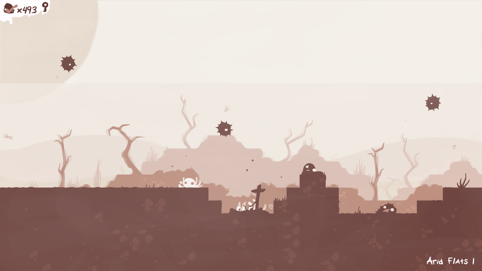

# Modifying Palettes
Once the palette.png file has been modified, or if you simply want to give an
area an existing palette, the tilesets.txt needs to be modified for a palette to
be assigned. Locate the unpacked game data and navigate to the "data\" directory,
in there will be a file called "tilesets.txt", open this file. Locate the area
which you would wish to modify, this can be found by looking at the area_name
variable which will list the name of each area. Once the area has been found
simply set the palette variable to the row number of your desired palette;
remember that the top-most row in the palette.png image is palette 0 and they
continue incrementing upwards in value the further down the image they are.

In the example below, the Arid Flats has been assigned the palette 10 (which is
used for Golgotha and Anguish). Changing this value and relaunching the game
produces the results on the right, compared to the original palette seen on the
left.

 

For a more in-depth look at the various aspects of the tilesets.txt file, as well
as how to modify it, click [here](../tilesets.md).

